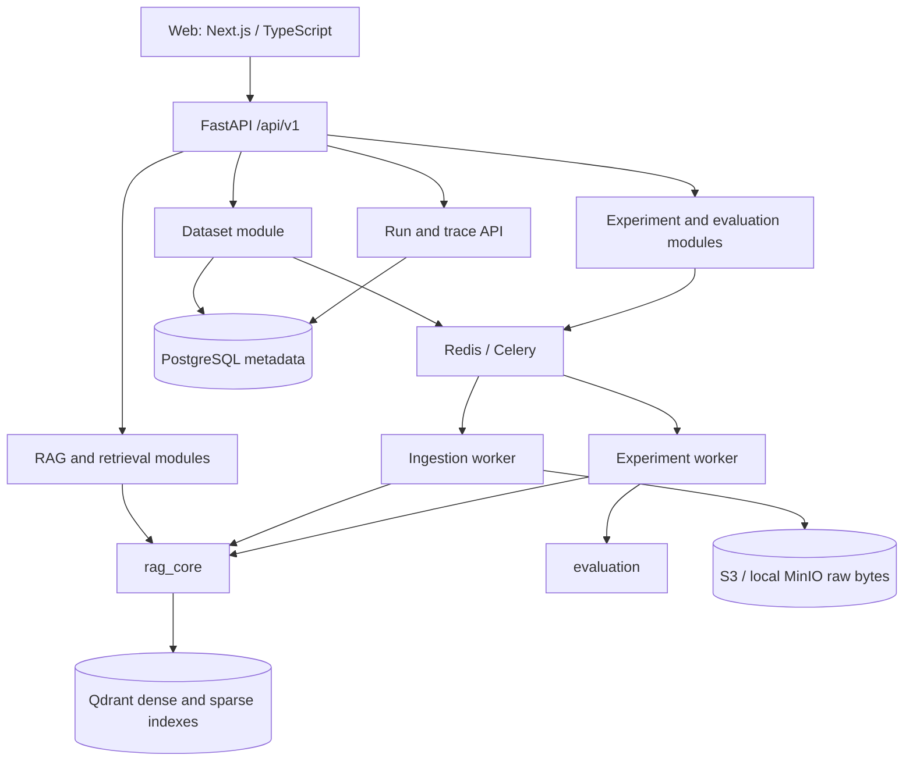

# Architecture A1

**Baseline: A1 — FROZEN.** Owner: Sai Sankeerth Thallapally. Approved design source:
the M0 Agentic RAG Lab assignment. This document distinguishes planned behavior
from runnable features; A00 implements governance only.

## Scope and module boundaries

A modular monolith for datasets, RAG execution, experiments, evaluations and traces.
API, web and workers are separate processes with shared, explicit package contracts.
No network call is needed merely to cross an internal business module boundary.

Runtime stack: Python 3.12+, uv workspace, FastAPI, Pydantic, SQLAlchemy, Alembic,
PostgreSQL, Qdrant, Redis/Celery and S3-compatible object storage. Web uses Next.js
App Router, TypeScript and pnpm. Use pytest, Ruff and one Python type checker.
LangGraph is reserved for stateful branching in advanced RAG. Ragas is a later
evaluation implementation behind our contracts, not a public domain dependency.

| Area | Responsibility | Owner |
| --- | --- | --- |
| `apps/api/app/core/` | Configuration, DB, service clients, errors, logging | Sai |
| API datasets/retrieval/RAG modules | Resource coordination, ingestion/query boundary | Sai |
| `packages/rag_core/` | Parsing/chunking, embeddings, retrieval, generation orchestration | Sai |
| `workers/ingestion/` | Bounded retryable ingestion jobs | Sai |
| `apps/web/` | Datasets, studio, playground, traces, comparisons | Vishnu |
| `packages/evaluation/` | Deterministic and semantic evaluation | Vishnu |
| API experiments/evaluations and `workers/experiments/` | Benchmark execution/results | Vishnu |
| `packages/contracts/`, migrations, root, infra, CI | Controlled shared interfaces and integration | Sai review |

Create directories only with their first useful file. Contracts depend on neither
API nor execution packages. Domain execution packages must not import API modules.
Evaluation consumes recorded retrieval/query evidence; it does not redefine the
retrieval engine. API and workers compose these packages.

## Storage and reproducibility

PostgreSQL is the durable source of truth for identities, metadata, job/run state,
configuration snapshots and trace references. S3 contains raw document bytes;
Qdrant contains search representations. Redis is a broker, never the authoritative
record of job completion or experiment results.

Datasets are logical corpora. Dataset versions pin source, parser, chunking,
embedding/index settings, document manifest and content hash. Published versions
are immutable; changed inputs/configuration produce a new version. Operational
progress belongs to ingestion jobs, separate from the version snapshot. Version
membership/provenance must remain unambiguous even when a source URI recurs.

Documents retain source metadata and object references. Chunks retain stable IDs,
document/dataset/version IDs, source type/identifier/title, section/page when known,
ordinal, hash, ingestion timestamp, chunking configuration and index profile. Raw
files are not stored as database blobs. Query results can reconstruct evidence via
these IDs without duplicating entire corpora in traces.

Index profiles pin dense model/revision/dimension/distance and optional sparse
model/revision. Compatible profiles can share physical Qdrant collections. Queries
always apply explicit dataset-version scope; one or many versions are allowed.
Do not equate a dataset with a collection or create high-cardinality user shards.
Incompatible embedding/index configurations require separate profiles/collections.

Pipeline configurations are immutable snapshots. Experiment definitions pin
dataset versions, question-set version, pipeline configs, metrics/evaluator
configuration, model revisions, prompt versions and application revision. Runs
retain that snapshot rather than dereferencing mutable settings during execution.
Record changed experimental conditions before comparing runs.

## Execution flows

Ingestion: source → load → parse → normalize → content hash/deduplicate → chunk →
bounded dense/sparse batches → Qdrant upserts. Raw bytes go to S3; canonical metadata,
checkpoints and durable status go to PostgreSQL. Use deterministic IDs, retries and
checkpoints. Accept streams/iterators and bounded batches; never require a corpus
to fit in memory or an hours-long HTTP request. S02 supplies this behavior.

Retrieval: validate explicit version scope → embed query → dense and/or sparse
candidates → RRF fusion for hybrid → optional bounded reranking → ordered results.
Results retain score, rank, retriever identity, provenance, filters and timings.
Reranking records candidate size, model, before/after ranks and duration. Qdrant is
the single V1 search engine; OpenSearch requires measured justification and review.

Generation consumes retrieved evidence through a small provider boundary; initially
target OpenAI-compatible endpoints. Record actual model/provider, usage and stable
citations. Unknown token counts or prices remain null, never invented zero costs.
Price estimates require the price registry version/effective date and currency.
Citations link claim → chunk → document → dataset version for independent checking.

Advanced RAG: CRAG retrieval grading/correction, SELF_REFLECTIVE_RAG prompt reflection,
multi-hop evidence accumulation and bounded agentic tools. LangGraph applies only
when persistent state and branching justify it. Set step, timeout and tool limits,
trace decisions, and record terminal failures. A prompt reflection loop is not the
academic Self-RAG mechanism. Plain retrieval and reranking use direct functions.

Experiments execute pinned questions across pinned configurations and persist each
query run, trace and metric result. Deterministic IR metrics require judgments;
semantic metrics record evaluator model/version/configuration. Missing reference
data must be explicit. Keep individual metrics; do not collapse them into one
unexplained quality score. Replay keeps the query fixed and records new conditions.

## Shared contracts and HTTP

Canonical Python/Pydantic concepts: Dataset, DatasetVersion, Document, Chunk,
IngestionJob, IndexProfile, PipelineConfig, RetrievalRequest, RetrievedChunk,
RetrievalResult, Citation, QueryRun, TraceEvent, ExperimentDefinition, ExperimentRun,
BenchmarkQuestion, EvaluationResult, MetricResult, CostUsage and LatencyBreakdown.
S01 establishes coherent schemas and initial tables, not these feature engines.

FastAPI OpenAPI describes implemented HTTP APIs and generates TypeScript definitions
reproducibly. Domain schemas can be included as reusable components without adding
fake operations. Future resources live under `/api/v1/`: datasets/versions,
ingestion-jobs, pipelines, query, experiments/runs, query runs/traces and evaluations.
`/health` reports process health; `/ready` checks required external dependencies and
database migration state. Failures use a structured error envelope without secrets.

Trace events carry run ID, sequence, stage, timestamps/duration, configuration
summary, input/output references, metrics and safe error data. Stages include
query_received, rewrite, selection, dense/sparse retrieval, fusion, rerank, grading,
agent/tool actions, generation, citation validation, evaluation and completion/failure.
Large payloads are referenced, not indiscriminately copied. Traces retain evidence
for future retrieval/ranking/generation/citation failure analysis.

## Security, scaling and non-goals

V1 is a local developer platform. Local services bind loopback. Secrets come from
environment/secret management, never Git, trace events or graph output. Uploaded
content is untrusted data, never executable instructions; source loaders will need
path/type/size limits. No speculative enterprise auth, billing, organizations or
RBAC. Public exposure requires a separately reviewed authentication/deployment plan.

Worker concurrency, batch sizes and checkpoints provide a path to horizontal
ingestion. Qdrant can later add shards/replicas/nodes without changing retrieval
contracts. This is a design direction, not a benchmarked billion-vector claim.
No GraphRAG, RAPTOR, autotuning, AI failure diagnosis or production monitoring suite
in the foundation. No full UI, retrieval engine or evaluation implementation in S01.

## Change control

New databases/search engines/queues, top-level services, auth, API paradigms, major
schema/contracts redesign or stack/topology replacements require an architecture
proposal, documented impact, Graphify, review and a new baseline (A2, etc.).
Latest explicit human instruction and current main supersede old task assumptions.
Independent review is required for Sai's substantive implementation PRs; unavailable
reviewers leave work REVIEW_PENDING_INDEPENDENT, never implicitly approved.
